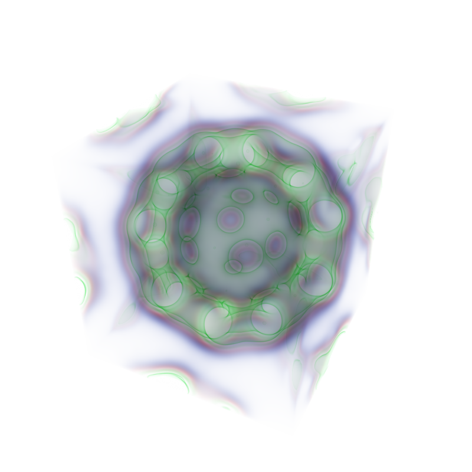

# VolumeRender

In this project, I experimented rendering scalar fields using ray marching and transfer functions with CUDA.

The main features are multiple transfer functions (Cubic interpolation between control points and one based on exponential functions),
cubic/linear interpolation of the scalar field and empty space map to speed up the rendering process.

Below you can see two rendering examples

